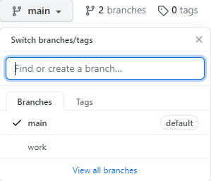

# 시작하기 전에
---

[github 페이지](https://pages.github.com) 는 github.io 주소로 블로그 및 홈페이지를 만들 수 있도록 제공하고 있다.

아래와 같은 정적 사이트 생성기(Static Site Generator)와 각각의 테마를 잘 활용하면 원하는 화면 구성으로 블로그를 쉽게(?) 구축 할 수 있다.

- [Jekyll](https://github.com/jekyll/jekyll)
- [Hugo](https://github.com/gohugoio/hugo)
- [Hexo](https://github.com/hexojs/hexo)

[github 페이지](https://pages.github.com)에서 Jekyll을 소개하고, 많이 사용되면서 테마도 많이 있다고 하지만, 여기서는 Hugo를 사용한 방법을 정리하도록 한다.

Hugo를 사용한 이유는
- Go 언어로 작성되어 있다고 하고, (크게 의미는 없다.)
- 가볍고 빠르다고 하며,
- Jeykll은 Ruby를 사용해야 하고, 별도 설치를 해야 한다는 점에서

Hugo가 더 끌렸던 것 같다.

 

# Hugo
---

- https://github.com/gohugoio/hugo

정적 사이트 생성이라는 이름에서 알 수 있듯이 미리 작성된 페이지와 레이아웃을

$ hugo

를 통해 빌드하게 되면 익숙한 html 형태의 웹페이지를 생성하게 된다.

여러 가이드 등을 확인하면 페이지 작성을 위한 repository와 publish를 위한 repository 두 개가 필요하다. 여기서는 추가 repository 대신 하나의 repository에서 branch를 나눠서 사용하는 방법을 정리한다.

(최근에는 Github Action을 통해 publish를 바로 할 수 있다고도 한다.)

우선 시작하기 hugo가 설치되어 있어야 하므로 아래 페이지에서 적당한 버전을 받아서 환경 변수 등록해둔다.

- https://github.com/gohugoio/hugo/releases

 

# 시작 
---

github 페이지는 아래와 같이 미리 정해진 repository 이름으로 서비스 된다.

> {userid}.github.io

위와 같이 repository를 만들었다면 아래와 같이 글 작성을 위한 브랜치를 하나 추가한다.

</img>
 
그럼 이제 작업을 위한 로컬 저장소를 준비한다.

~/github/hyunh.github.io.work$ git init 
~/github/hyunh.github.io.work$ git remote add origin https://github.com/hyunh.github.io.git 
~/github/hyunh.github.io.work$ git fetch origin

여기 까지 하면 아래와 같이 Remote 브랜치를 가져오게 되고,

~/github/hyunh.github.io.work$ git branch -a 
&nbsp; &nbsp;origin/main 
&nbsp; &nbsp;origin/work

필요한 것은 work 브랜치이기 때문에, work로 체크아웃 해준다.

~/github/hyunh.github.io.work$ git checkout -t origin/work 
~/github/hyunh.github.io.work$ git branch -a 
* work 
&nbsp; &nbsp;origin/main 
&nbsp; &nbsp;origin/work

 

# Hugo new site
---

저장 공간도 준비해두었으니 Hugo로 새로운 사이트를 만들 차례이다.

- https://gohugo.io/commands/hugo_new_site/

위 가이드와 같이 명령어를 입력하면, 이미 저장 공간을 만들어 놨기 때문에 에러가 발생하니, 

~/github$ hugo new site hyunh.github.io.work 
Error: /home/hyunh/github/test/hyunh.github.io.work already exists and is not empty. See --force.

--force 옵션도 포함하여 입력하면 성공적으로 사이트를 생성 할 수 있다.

~/github$ hugo new site hyunh.github.io.work --force

 

# Build 
---

위에서 만든 사이트는 사이트를 위한 설정 값, 레이아웃 등을 모아놓은 데이터일 뿐이고, 실제 웹사이트로 만들기 위해서는 빌드를 해야한다.

~/github/hyunh.github.io.work$ hugo

hugo 명령어를 통해 빌드가 완료되면 public 디렉토리 안에 빌드된 내용이 생성된다.

public 디렉토리 안에 내용을 처음에 만들어 놓은 main 브랜치로 푸시하면 아래 주소로 우리가 만든 페이지를 접속 할 수 있게 된다.

- hyunh.github.io 

푸시 전에 미리 결과물을 확인하고 싶다면 아래와 같이 입력하면 로컬 호스트(127.0.0.1:1313)로 접속하여 결과물을 확인 할 수 있다.

~/github/hyunh.github.io.work$ hugo server

